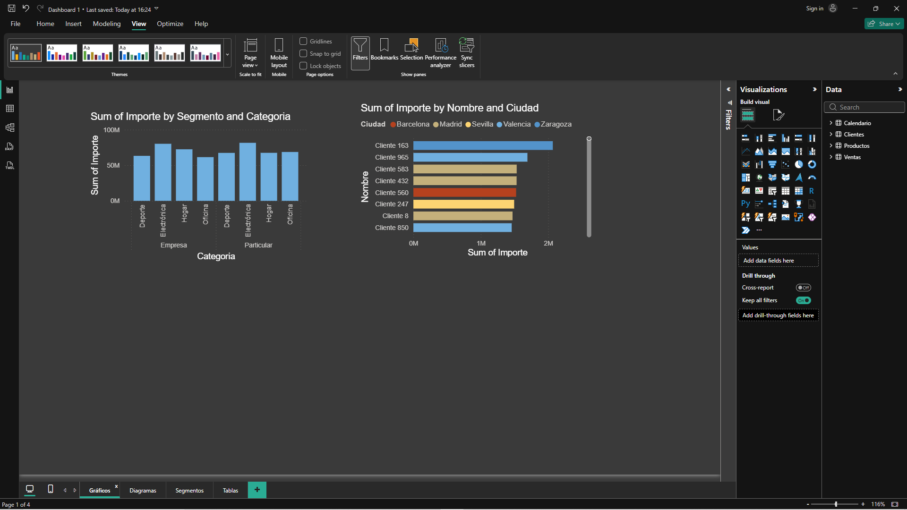
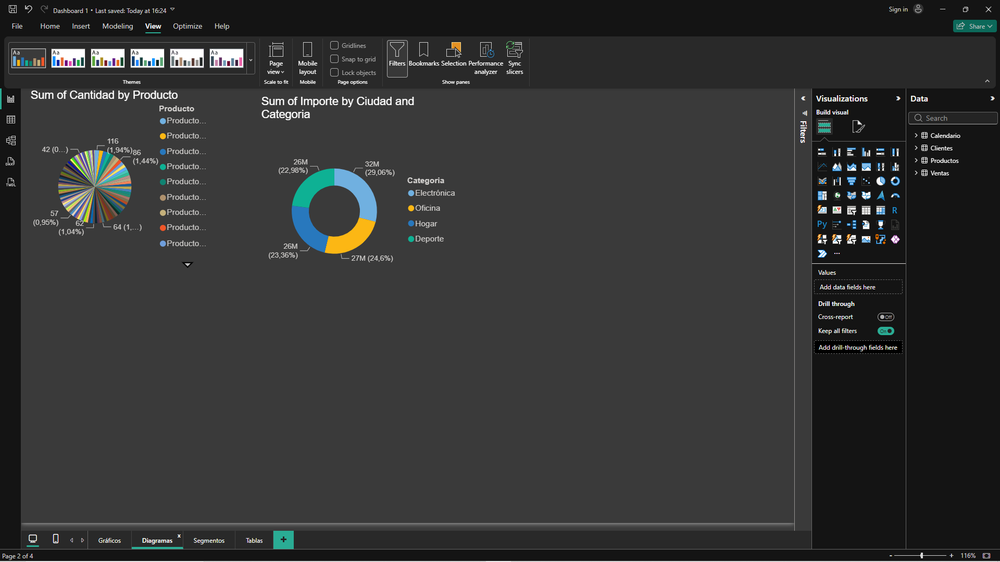
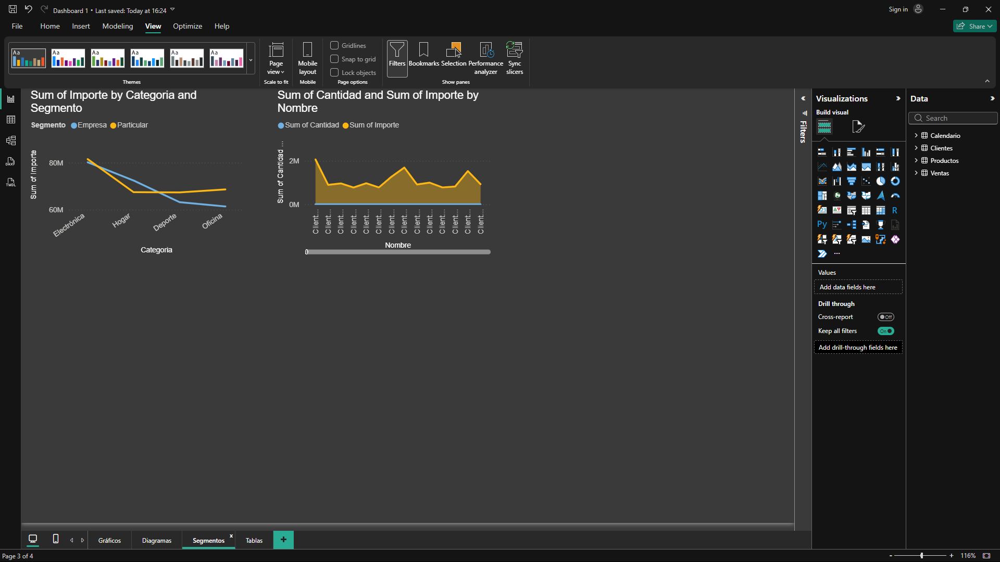
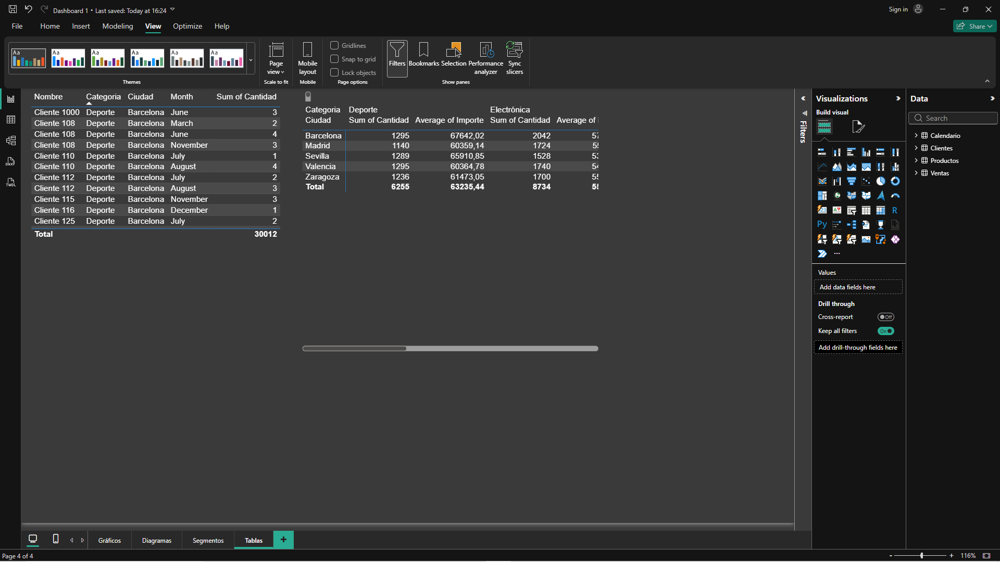

# Nova Retail Sales Dashboard
## Descripción
Proyecto realizado con Power BI utilizando un dataset de una empresa ficticia de retail.
## Objetivos
- Analizar las ventas.
- Identificar los productos más vendidos.
- Analizar clientes.
- Visualizar la evolución temporal.
## Herramientas
- Power BI
## Vista general

## Análisis de ventas

## Análisis de clientes

## Análisis de productos

